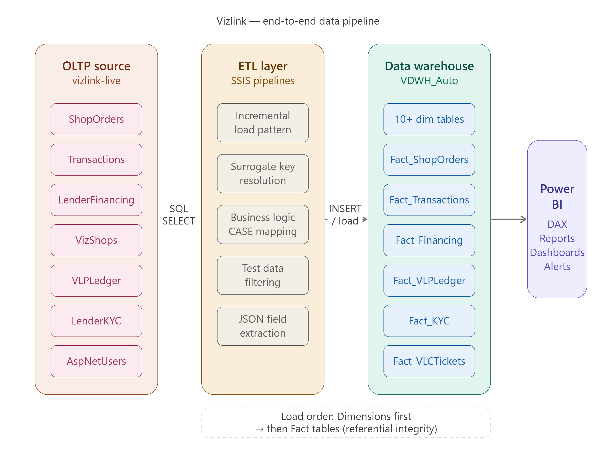
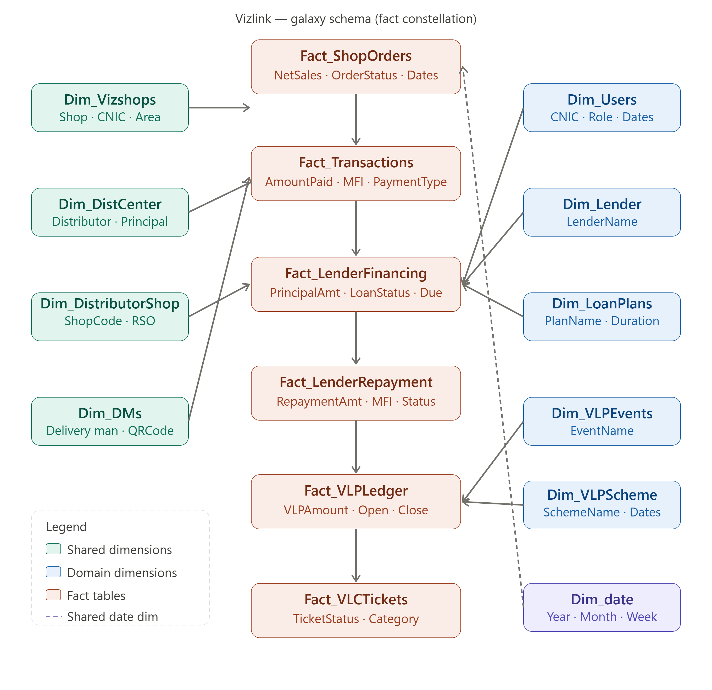
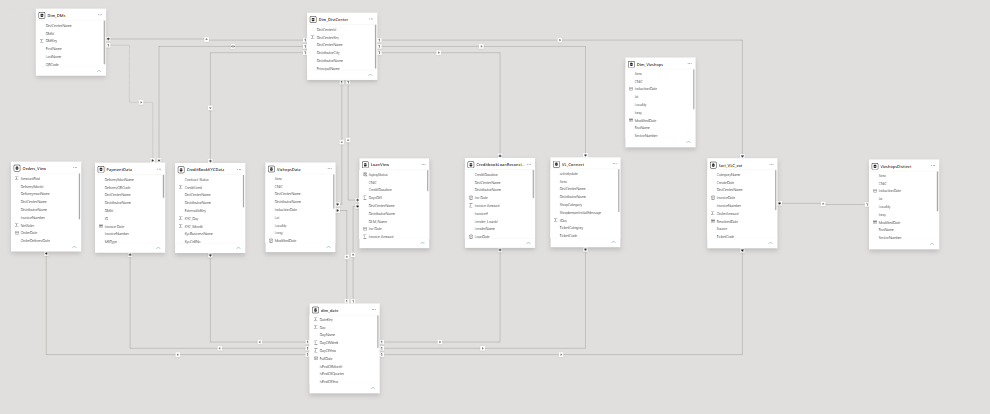

# Vizlink-FinTech-FMCG-DataWareHouse
End-to-end Data Warehouse project including ETL pipelines, data modeling, business logic, and reporting for Vizlink analytics system.
---

## Problem Statement

FMCG distributors in Pakistan manage hundreds of retailer cash collections daily. Before Vizlink, this process was entirely manual — delivery men collected payments in cash, recorded them on paper, and data was reconciled in Excel days later. This created:

- No real-time visibility into payment status
- High risk of fraud and unrecorded collections
- No way to track agent performance or shop-level trends
- Zero integration between distributor ERP and digital payment rails (JazzCash, EasyPaisa)

---

## Solution Overview

Vizlink is a digital collection platform where delivery men collect payments via mobile wallets (MFI). This warehouse sits on top of the OLTP system and enables analytics across the full collection lifecycle — from order creation to payment, financing, loyalty points, and support tickets.

The pipeline moves data from the live transactional database into a purpose-built data warehouse, then serves reports via Power BI.

---

## Architecture




**Tech Stack:**

| Layer | Technology |
|---|---|
| Source (OLTP) | SQL Server — `vizlink-live` |
| ETL | SSIS (SQL Server Integration Services) |
| Data Warehouse | SQL Server — `VDWH_Auto` |
| Query Language | T-SQL |
| Reporting | Power BI (DAX) |

---

## Data Model

Schema type: **Galaxy Schema (Fact Constellation)** — multiple fact tables sharing common dimensions.




---
**Fact Tables:**

| Table | Business Domain | Key Measures |
|---|---|---|
| `Fact_ShopOrders` | Sales orders | NetSales, OrderStatus |
| `Fact_ShopOrderTransactions` | Digital payments | AmountPaid, MFI type |
| `Fact_LenderFinancing` | BNPL / loans | PrincipalAmount, LoanStatus |
| `Fact_LenderRepayment` | Loan repayments | RepaymentAmount |
| `Fact_VLPLedger` | Loyalty points | VLPAmount, Open/Close balance |
| `Fact_VLCTickets` | Support tickets | TicketStatus, Category |

**Dimension Tables:** `Dim_Vizshops`, `Dim_DistCenter`, `Dim_DistributorShop`, `Dim_Users`, `Dim_DMs`, `Dim_Lender`, `Dim_LoanPlans`, `Dim_VLPEvents`, `Dim_VLPScheme`, `Dim_date`

→ Full model details: [02_data_modeling/data_model.md](02_data_modeling/Readme.md)

---

## ETL Pipeline

- **Tool:** SSIS (SQL Server Integration Services)
- **Pattern:** Incremental load — `WHERE id NOT IN (SELECT id FROM DWH_table)`
- **Load order:** Dimensions first → Fact tables (referential integrity)
- **Business logic:** Status codes decoded via CASE statements at load time (LoanStatus, KYCStatus, TicketStatus)
- **Data quality:** Test distributor records filtered at source

→ Pipeline details: [04_etl/README.md](04_etl/ETL.md)

---

## Business Domains Covered

- **Collections** — order-to-payment tracking across MFI channels (JazzCash, EasyPaisa)
- **BNPL Financing** — lender KYC, loan lifecycle, repayment tracking
- **Loyalty (VLP)** — points earned per transaction, scheme-wise ledger
- **Support (VLC)** — shopkeeper complaint tickets, resolution tracking
- **Agent Activity** — delivery man performance, tagging, activity logs

---

## Repository Structure

```
vizlink-dwh/
├── README.md
├── 01_architecture/        → pipeline flow diagram
├── 02_data_modeling/       → schema diagram + table definitions
├── 03_ddl/                 → CREATE TABLE scripts
├── 04_etl/                 → SSIS pipeline docs + INSERT queries
├── 05_business_logic/      → status code mappings
└── 06_reporting/           → Power BI screenshots + DAX measures
```

---
## Power BI Data Model View



---

## Dashboard Preview

| Induction | M2D Collections |
|---|---|
|  |  |

| Financing & KYC | VL Connect |
|---|---|
|  |  |
---
→ Full Dashboard Details: [Dashboard_Detail](06_reporting/Readme.md)
## Key Design Decisions

**Why Galaxy Schema over Star?**
Multiple business domains (orders, loans, loyalty, tickets) share the same dimension tables (shops, users, distribution centers). A single star schema would require duplicating dimensions or creating a monolithic fact table. Galaxy schema keeps each domain clean while sharing conformed dimensions.

**Why incremental load over full refresh?**
The OLTP database is live 24/7. Full truncate-and-reload would cause reporting gaps and put unnecessary load on the production database. Incremental load (`NOT IN` / `NOT EXISTS` pattern) inserts only new records.

**Why decode status codes in ETL?**
Source OLTP stores statuses as integers (`LoanStatus = 6`). Decoding them in the ETL layer (`'Disbursed'`) means Power BI reports always show human-readable values without runtime lookups.

---

*Built solo at Vizpro — from OLTP design through ETL pipeline to Power BI reporting layer.*
